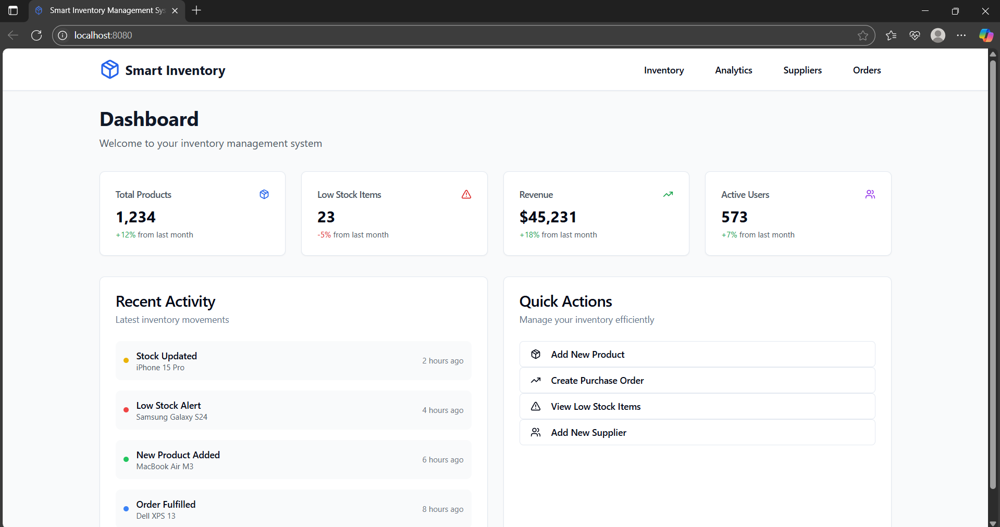

# 📦 Smart Inventory Management System

A modern, AI-assisted inventory management dashboard built using **React 19**, **TypeScript**, **Tailwind CSS**, and **Vite**. Designed for small to medium-sized businesses to efficiently manage products, suppliers, purchase orders, and analytics — all through a clean and professional frontend interface.

---

## 📸 Project Preview



---

## 🚀 Tech Stack

### 🧱 Core Frameworks & Tools

- ⚛️ React 19 with TypeScript
- ⚡ Vite – lightning-fast development
- 🎨 Tailwind CSS – utility-first responsive styling
- 🧩 shadcn/ui – elegant, accessible UI components

### 🔌 Libraries & Integrations

- 🌍 React Router – client-side routing
- 🔄 TanStack React Query – state and data fetching
- 📈 Recharts – elegant chart visualizations
- ✅ React Hook Form + Zod – validated and type-safe forms
- 🔔 Sonner – toast notifications
- 🧠 Lucide Icons – modern icons

---

## 📁 Folder Structure

```bash
smart-inventory/
├── public/                # Static assets (favicon, open graph image, etc.)
│   ├── favicon.png
│   └── open-graph-logo.png

├── src/
│   ├── components/        # Reusable UI components
│   │   ├── ui/
│   │   ├── SupplierCard.tsx
│   │   ├── SupplierList.tsx
│   │   └── SupplierSearch.tsx
│   ├── hooks/             # Custom React hooks
│   ├── lib/               # Utility functions
│   ├── pages/             # Main page views (Dashboard, Inventory, Orders, etc.)
│   ├── App.tsx            # Root app component
│   ├── main.tsx           # Entry point
│   ├── index.css
│   └── App.css

├── index.html             # Page template & metadata
├── tailwind.config.ts     # Tailwind configuration
├── vite.config.ts         # Vite configuration
├── tsconfig.json          # TypeScript configuration
└── README.md              # This file
```
